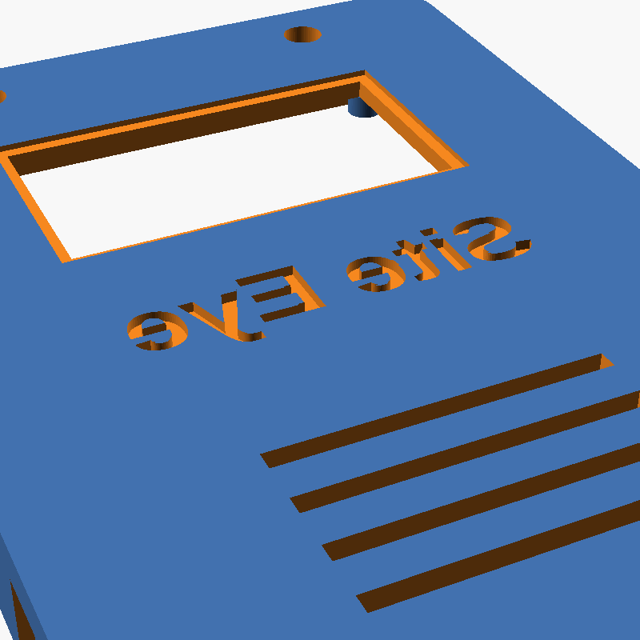
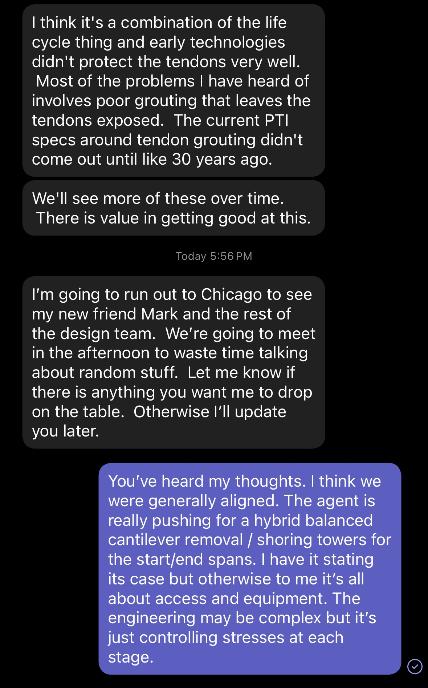
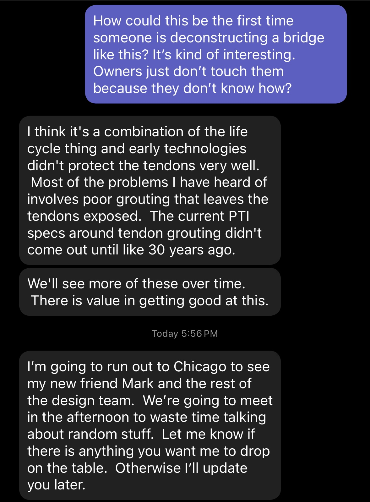
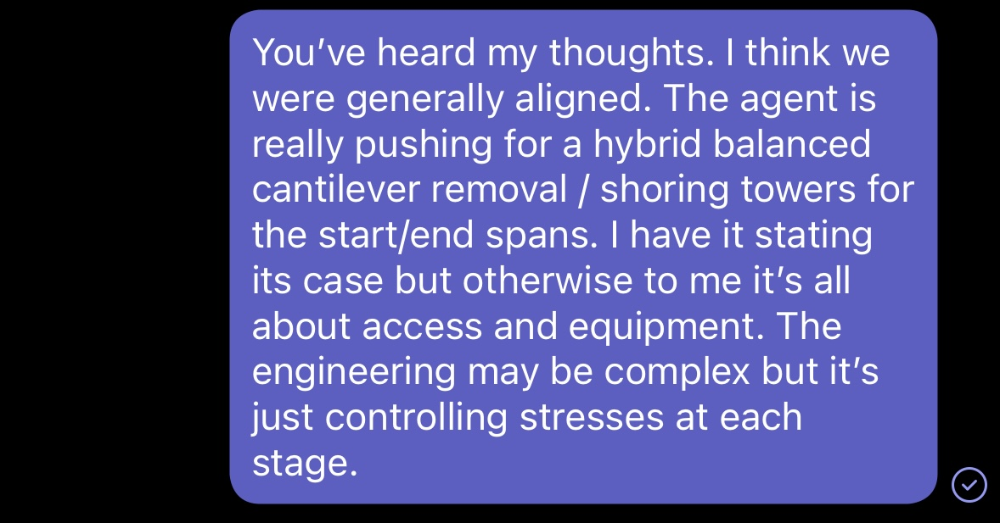
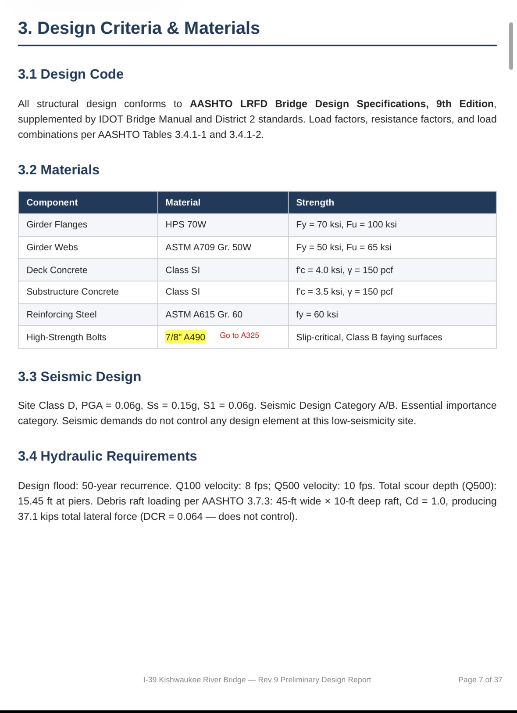
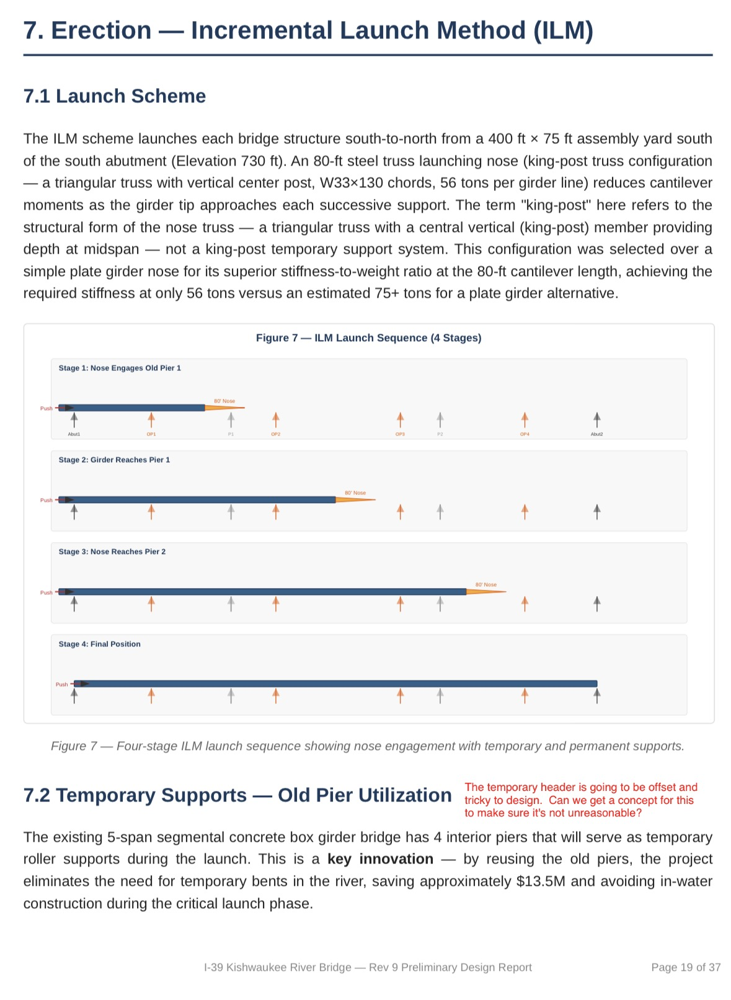
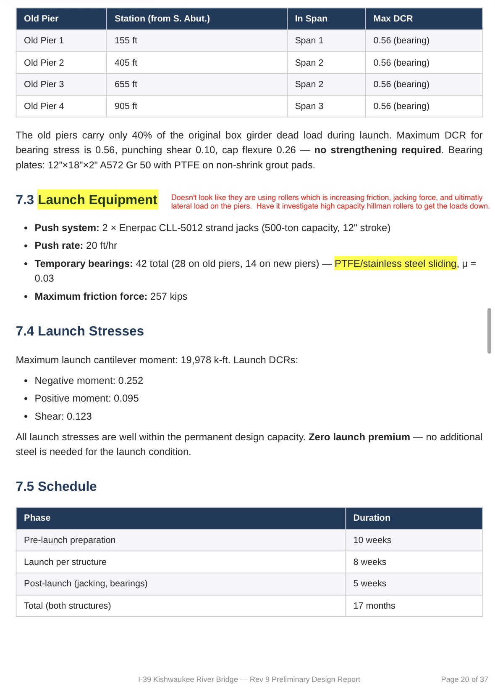
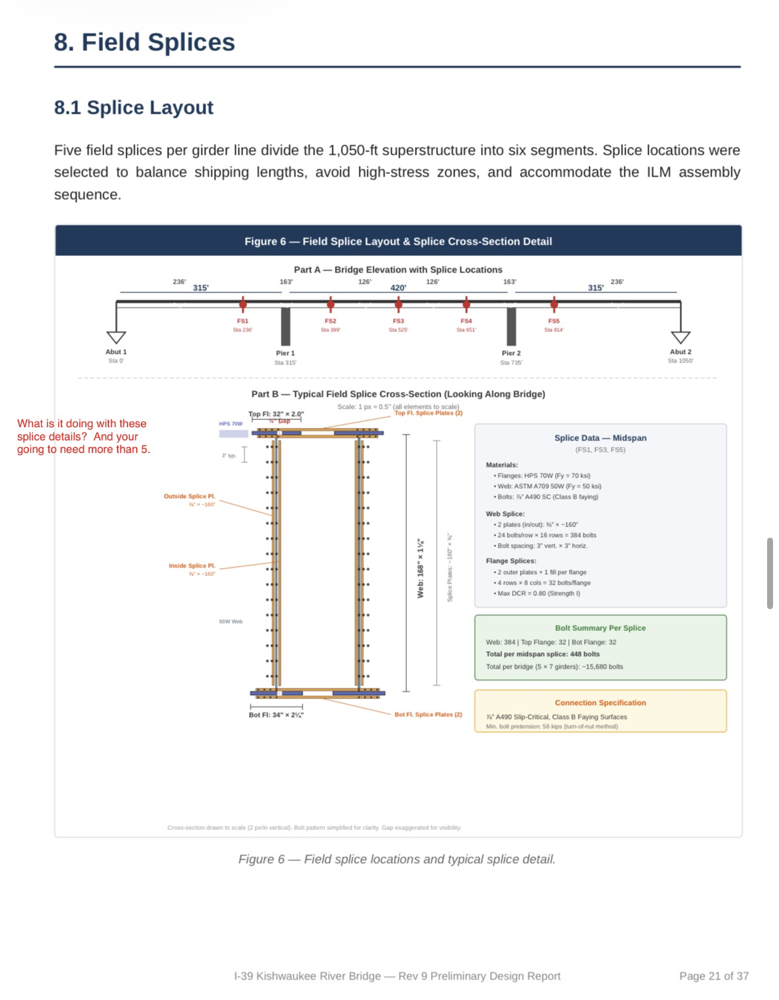
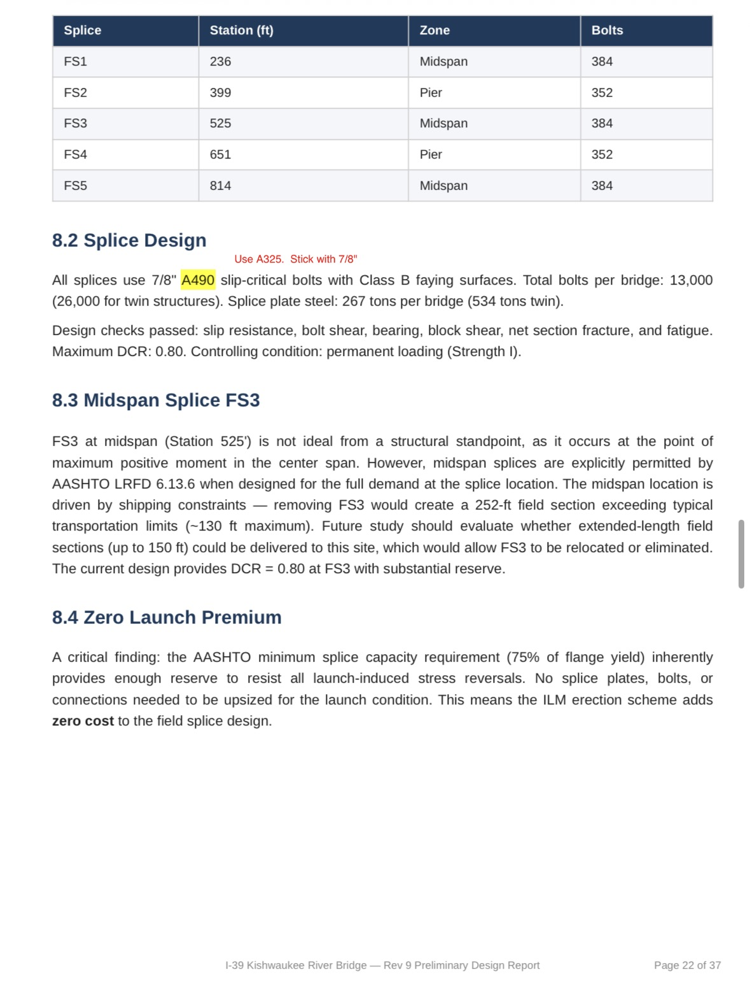

# SiteEye v0.2

*AI-powered wearable for construction sites. Voice + vision in a badge-sized form factor.*

---

## What Is It

A wearable AI device built on a Raspberry Pi Zero 2W with camera, mic, speaker, and OLED display. Press a button to talk, press another to snap a photo. It sees what you see and talks back.

Designed for construction jobsites — hands-free AI that clips to your vest.

---

## Hardware

### Core
| Part | Model | Notes |
|------|-------|-------|
| Computer | Raspberry Pi Zero 2W | 64-bit, WiFi, BT |
| Camera | Sony IMX500 AI Camera | On-chip neural net, CSI ribbon |
| Display | Inland 1.3" OLED (SH1106) | SPI mode, IIC/SPI jumper board |
| Microphone | INMP441 I2S MEMS | Digital mic, low output (needs +25dB gain) |
| Amplifier | MAX98357A I2S DAC/Amp | 3W class D, GAIN→GND for 24dB |
| Speaker | PUI Audio AS04004PO-2-R | 4Ω 3W oval |
| Battery | PiSugar 3 + 1200mAh LiPo | Portable power |
| Buttons | Tactile push buttons (×2) | Voice + Camera triggers |

### Form Factor
- Wearable lanyard, badge-sized (~85×55×15-20mm)
- Camera forward, speaker outward, mic hole top
- OLED for glanceable status (animated eyes)

---

## Pin Map

| Pi Pin | GPIO | Device | Function |
|--------|------|--------|----------|
| 1 | 3.3V | OLED | VCC |
| 2 | 5V | MAX98357A | VIN |
| 6 | GND | OLED | GND |
| 9 | GND | INMP441 | GND + L/R (both to GND) |
| 11 | GPIO 17 | Button 2 | Camera |
| 12 | GPIO 18 | INMP441 + MAX | SCK / BCLK (shared) |
| 13 | GPIO 27 | Button 1 | Voice |
| 14 | GND | MAX98357A | GND |
| 17 | 3.3V | INMP441 | VDD |
| 18 | GPIO 24 | OLED | DC |
| 19 | GPIO 10 | OLED | MOSI |
| 22 | GPIO 25 | OLED | RES |
| 23 | GPIO 11 | OLED | CLK |
| 24 | GPIO 8 | OLED | CS |
| 35 | GPIO 19 | INMP441 + MAX | WS / LRC (shared) |
| 38 | GPIO 20 | INMP441 | SD (data in) |
| 40 | GPIO 21 | MAX98357A | DIN (data out) |

### Reserved (future)
| Pi Pin | GPIO | Purpose |
|--------|------|---------|
| 8 | GPIO 14 | BLE UART TX (nRF52840) |
| 10 | GPIO 15 | BLE UART RX (nRF52840) |
| 15 | GPIO 22 | BLE RST |
| 16 | GPIO 23 | BLE INT |
| 36 | GPIO 16 | NeoPixel RGB LED |

---

## OLED Eyes

SiteEye has expressive Cozmo-style animated eyes powered by `oled_ui.py`:

### Eye Style
- **Filled white rounded rectangles** with black pupil circles and white highlight reflections
- **Lid masking** — black rectangles slide over from top/bottom for expressions
- **Asymmetric scaling** — eyes resize based on look direction (3D perspective effect)

### Expressions
| Expression | Description |
|-----------|-------------|
| Idle | Blinks, random look-around, micro-expressions (happy, curious, suspicious, confused) |
| Listening | Wide open, raised eyebrows, pulsing dots |
| Thinking | Squinted, furrowed brows, darting figure-8 eye movement |
| Speaking | Relaxed, gentle sway, mood shifts |
| Happy | Curved bottom lids (smile shape) |
| Angry | Angled top lids, furrowed brows |
| Sad | Droopy brows, angled bottom lids |
| Confused | One brow raised, one flat |
| Suspicious | One eye more squinted than the other |
| Alert | Flash-wide with exclamation mark |
| Sleepy | Slow droop to half-closed |
| Wink | Right eye only |

### Animation Features
- **Boot sequence** — eyes open from closed with quick look-around
- **Smooth pupil tracking** — lerp interpolation for natural movement
- **Saccade movements** — 30% of look changes are fast snaps (like real eyes)
- **Double blink** — 20% chance for natural feel
- **Eased transitions** — smooth in/out on all state changes
- **Eyebrows** — raised (surprise), furrowed (focus), angled (angry/sad)

---

## Software Stack

### OS
- Raspberry Pi OS Lite (64-bit, Bookworm)

### /boot/firmware/config.txt additions
```
dtparam=spi=on
dtparam=i2s=on
dtoverlay=googlevoicehat-soundcard
```

### Dependencies
```bash
sudo apt install -y python3-pip python3-pil python3-spidev sox libsox-fmt-all
pip3 install luma.oled gpiozero
```

### Audio Config

**~/.asoundrc** (and /etc/asound.conf):
```
pcm.speaker {
    type dmix
    ipc_key 1024
    slave {
        pcm "hw:1,0"
        rate 48000
        channels 2
        format S32_LE
    }
}
```

**Amp keepalive service** (eliminates click on play):
```ini
# /etc/systemd/system/amp-keepalive.service
[Unit]
Description=Keep I2S amp alive (no click)
After=sound.target
[Service]
ExecStart=/etc/systemd/system/amp-keepalive.sh
Restart=always
[Install]
WantedBy=multi-user.target
```

---

## Setup

### Quick Start
```bash
git clone https://github.com/mjamiv/SiteEye.git
cd SiteEye
scp main.py oled_ui.py setup-service.sh pi-molt@molt-device.local:~/
ssh pi-molt@molt-device.local "bash setup-service.sh"
```

### Auto-Start Service
The `setup-service.sh` script creates a systemd service that:
- Extracts API keys from `.bashrc` into `~/.env`
- Creates and enables `siteeye.service`
- Starts `main.py` automatically on boot
- Restarts on failure with 5-second delay

### Manual Control
```bash
sudo systemctl status siteeye    # check status
sudo systemctl restart siteeye   # restart
sudo systemctl stop siteeye      # stop
sudo journalctl -u siteeye -f    # live logs
```

---

## Architecture

```
┌─────────────┐     ┌──────────────┐     ┌──────────────┐
│   SiteEye   │────▶│  VPS Proxy   │────▶│  AI Backend  │
│  (Pi Zero)  │◀────│  :5757       │◀────│              │
└─────────────┘     └──────────────┘     └──────────────┘
      │                    │
      │                    ├──▶ Whisper (STT)
      ├──▶ TTS Engine      ├──▶ GPT-4o (Vision)
      ├──▶ Telegram Bot     └──▶ Sonnet (Chat)
      └──▶ OLED Display
```

### Voice Flow
1. Press Voice button → eyes go wide ("listening")
2. Record I2S mic (S32_LE, 48kHz, stereo)
3. Press again → stop recording
4. Sox boost +25dB, convert to 16kHz mono → Whisper STT
5. Eyes squint ("thinking") → Proxy `/chat` → AI response
6. Response on OLED → TTS → sox EQ → speaker
7. Eyes return to idle animation

### Camera Flow
1. Press Camera button → eyes flash alert ("capturing")
2. rpicam-still 640×480 with vflip/hflip
3. Photo sent to Telegram via bot API
4. Eyes squint ("thinking") → Proxy `/vision` → GPT-4o analysis
5. Response on OLED → TTS → speaker
6. Eyes return to idle

### Audio EQ
```
bass +6 | treble -7 3000 | lowpass 8000
```
De-esses sibilance, adds warmth. Tuned for small speaker output.

---

## Key Files

| File | Purpose |
|------|---------|
| `main.py` | Device client — voice/camera flows, button handling |
| `oled_ui.py` | OLED animated eyes engine (Cozmo-style) |
| `server.py` | VPS proxy server |
| `setup-service.sh` | Auto-start service installer |

---

---

## Case Design — 3D Printed Wearable Enclosure

SiteEye ships in a custom-designed 3D printed badge-sized enclosure. Full design docs, OpenSCAD source, and STL exports are in [`case-design/`](case-design/).

### v6 Enclosure (Current)



**Form factor:** 58 × 82 × 34mm — badge-sized, lanyard-worn at chest level.

- **Two-piece snap-fit** — front shell (camera side) + back shell (OLED side), clip together at 4 corners
- **Camera faces forward** — IMX500 on the front shell, sees what you see
- **OLED faces you** — 1.3" display on the back shell, readable by glancing down
- **Single inset lanyard loop** at top — breakaway clasp for construction site safety
- **Integrated component cradles** — 36mm speaker cradle, 14mm mic cradle, Pi Zero 2W standoff pattern
- **PETG (black)** — heat/impact resistant, professional look, ~22g filament per enclosure

The v6 design addresses 13 issues from prototype review: corrected OLED mounts, dedicated mic vent, speaker cradle, bottom USB access, right-reading labels, and full interior clearance for all components including PiSugar battery.

### Build Photos

| Photo | Description |
|-------|-------------|
|  | Assembly overview |
|  | Front shell detail |
|  | Internal components |
|  | Camera mount |
|  | OLED side |
|  | Assembled unit |
|  | Worn on lanyard |
|  | Side profile |

→ **[Full case design docs, STL files, and printing instructions](case-design/README.md)**

---

## Hardware Status

| Component | Status |
|-----------|--------|
| Pi Zero 2W | ✅ Working |
| IMX500 AI Camera | ✅ Working |
| 1.3" OLED (SH1106) | ⚠️ Broken (hardware fault) |
| INMP441 Mic + MAX98357A Amp | ✅ Working |
| PUI Audio Speaker | ✅ Working |
| PiSugar 3 + 1200mAh LiPo | ✅ Working |
| Tactile Buttons (×2) | 🔲 Pending wiring |
| 3D Printed Enclosure (v6) | ✅ Designed, printing |
| NeoPixel RGB LED | 🔲 Not purchased |

---

## Known Issues & TODO
- [ ] OLED broken — replacement needed
- [ ] NeoPixel LED not purchased/wired
- [ ] Buttons pending wiring to GPIO 17/27
- [ ] OLED sometimes needs `sudo killall python3` before restart (GPIO not released)
- [ ] BLE 5.0 mesh networking (nRF52840 DNP on PCB for v1)

---

## Lessons Learned
1. **SPI speed matters on breadboard.** Default 8MHz fails — 500kHz works reliably with jumper wires.
2. **Process exit resets OLED.** luma.oled cleans up GPIO on exit — display goes blank. Keep process alive.
3. **INMP441 records low.** Always boost +20-25dB with sox before sending to STT.
4. **I2S format must match exactly.** 48kHz stereo S32_LE for both record and playback.
5. **Breadboard rows can be unreliable.** DIN wire worked direct but not through breadboard.
6. **Amp keepalive eliminates click.** dmix + silent background stream prevents power cycle pop.
7. **Buttons wire across, not along.** Same-side legs are always connected — wire to opposite legs.
8. **Kill all python3 before restarting.** GPIO won't allocate if previous process still holds pins.
9. **De-ess small speakers.** treble -7 @3kHz + lowpass 8kHz tames sibilance without killing clarity.
10. **Filled rounded rects > outlined ellipses.** Way more contrast and readability on tiny OLEDs. The Cozmo/Vector style works.
11. **Saccades make eyes feel alive.** Mix fast snaps with smooth tracking — real eyes do both.

---

## License

MIT
